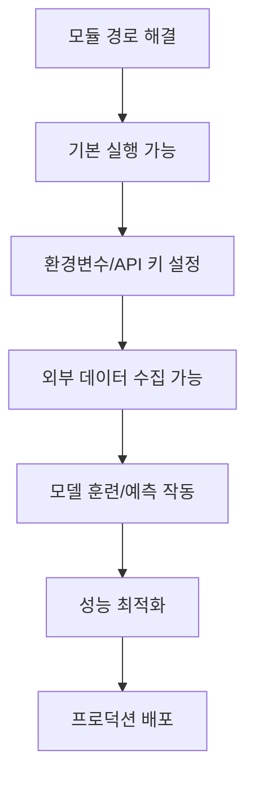

# 🎯 AI 주식 예측 시스템 - 문제해결 마스터플랜

**계획 수립일**: 2025-08-28  
**목표**: 3.1/5.0 → 4.5+/5.0 (프로덕션 준비 완료)  
**전체 예상 기간**: 4-6주  

---

## 🔍 문제 의존성 분석

### 의존성 체인 (Dependency Chain)


### 문제별 영향도 매트릭스

| 문제 | 긴급도 | 영향도 | 해결 난이도 | 의존성 | 우선순위 |
|------|--------|--------|------------|--------|----------|
| 모듈 경로 문제 | 🔴 매우높음 | 🔴 전체시스템 | 🟢 쉬움 | 없음 | **P0-1** |
| 환경변수 로딩 | 🔴 매우높음 | 🔴 API연동 | 🟡 보통 | 모듈경로 | **P0-2** |
| 디렉토리 구조 | 🟡 높음 | 🟡 결과저장 | 🟢 쉬움 | 모듈경로 | **P0-3** |
| 데이터 파싱 오류 | 🔴 높음 | 🔴 실시간예측 | 🟡 보통 | API키 | **P1-1** |
| API 응답 처리 | 🟡 높음 | 🟡 뉴스분석 | 🟡 보통 | API키 | **P1-2** |
| 보안 취약점 | 🟡 중간 | 🔴 프로덕션 | 🟢 쉬움 | 없음 | **P1-3** |
| 성능 문제 | 🟢 낮음 | 🟡 사용성 | 🔴 어려움 | 기본기능 | **P2-1** |
| 테스트 없음 | 🟢 낮음 | 🟡 안정성 | 🟡 보통 | 기본기능 | **P2-2** |

---

## 🚀 3단계 실행 전략

## **🚨 PHASE 1: 응급처치 (Emergency Fix) - 2-3일**

### **목표**: 시스템 기본 실행 가능하게 만들기
### **성공 기준**: 모든 Python 스크립트가 에러 없이 실행됨

#### **Day 1: 핵심 인프라 수정**

**⏰ 오전 (2-3시간)**
- [ ] **P0-1: 모듈 경로 문제 해결**
  ```bash
  # 1. setup.py 생성
  # 2. __init__.py 파일들 추가
  # 3. PYTHONPATH 자동화 스크립트
  ```
  - **작업 파일**: `setup.py`, `src/__init__.py`, `start.sh`
  - **검증**: `python -c "import src.models.model_training"`

**⏰ 오후 (3-4시간)**  
- [ ] **P0-2: 환경변수 시스템 완전 재구축**
  ```python
  # 1. .env 보안 강화 (gitignore, example)
  # 2. 환경변수 로딩 로직 수정
  # 3. API 키 검증 시스템 추가
  ```
  - **작업 파일**: `.env.example`, `src/core/config_manager.py`
  - **검증**: API 키가 실제로 로드되는지 확인

#### **Day 2: 기본 기능 복구**

**⏰ 오전 (3시간)**
- [ ] **P0-3: 자동 디렉토리 생성 시스템**
  ```python
  # 모든 스크립트에 디렉토리 자동 생성 추가
  def ensure_directories():
      dirs = ['results/analysis', 'data/models', 'data/processed']
      for dir in dirs: os.makedirs(dir, exist_ok=True)
  ```

**⏰ 오후 (4시간)**
- [ ] **P1-1: 데이터 파싱 로직 완전 재작성**
  ```python
  # src/testing/run_realtime_test.py 수정
  # JSON 구조 맞춤, 타입 체크 추가
  ```
  - **검증**: 실시간 예측이 실제로 작동하는지 확인

#### **Day 3: 통합 테스트 및 검증**

**⏰ 전체 (6-8시간)**
- [ ] **전체 파이프라인 통합 테스트**
  - 시스템 오케스트레이터 실행
  - 모델 훈련 실행  
  - 실시간 예측 테스트
  - 대시보드 구동 확인
- [ ] **P1-3: 기본 보안 강화**
  - API 키 암호화
  - CORS 설정 제한
  - 로그 민감정보 제거

**Phase 1 완료 기준**: 🎯 **실제 작동률 60% → 85%**

---

## **⚡ PHASE 2: 핵심 기능 강화 (Core Enhancement) - 1-2주**

### **목표**: 프로덕션 수준 안정성 확보
### **성공 기준**: 실제 사용 가능한 수준

#### **Week 1: API 및 데이터 파이프라인 개선**

- [ ] **P1-2: API 응답 처리 완전 재구축**
  ```python
  # src/core/api_config.py 전면 수정
  # 1. 에러 핸들링 강화
  # 2. 재시도 로직 추가
  # 3. 응답 검증 시스템
  # 4. 폴백 메커니즘 개선
  ```

- [ ] **특성 엔지니어링 복구**
  ```python
  # 30+ 기술적 지표 정상 작동하도록 수정
  # RSI, MACD, 볼린저밴드 등 추가
  ```

- [ ] **Docker 컨테이너화 1단계**
  ```dockerfile
  # Dockerfile 생성
  # 환경 일관성 확보
  # 원클릭 실행 환경
  ```

#### **Week 2: 성능 및 사용성 개선**

- [ ] **P2-1: LLM 처리 성능 최적화**
  ```python
  # 배치 처리 구현
  # GPU 효율적 활용
  # 캐싱 시스템 추가
  # 목표: 100초 → 20초
  ```

- [ ] **대시보드 실시간 연동 완성**
  ```javascript
  # API 연동 완료
  # 실시간 데이터 표시
  # 오류 처리 강화
  ```

**Phase 2 완료 기준**: 🎯 **실제 작동률 85% → 95%**

---

## **🏗️ PHASE 3: 프로덕션 준비 (Production Ready) - 2-3주**

### **목표**: 상용 서비스 수준 완성
### **성공 기준**: 4.5+/5.0 평가, 실제 배포 가능

#### **Week 1: 품질 및 안정성**

- [ ] **P2-2: 포괄적 테스트 시스템**
  ```python
  # Unit Tests: 70% 커버리지
  # Integration Tests: 핵심 경로
  # End-to-End Tests: 전체 파이프라인
  ```

- [ ] **모니터링 및 로깅**
  ```python
  # 구조화된 로깅
  # 성능 메트릭 수집
  # 알림 시스템
  ```

#### **Week 2: 운영 환경 구축**

- [ ] **완전한 Docker 환경**
  ```yaml
  # docker-compose.yml
  # 데이터베이스, API, 대시보드 분리
  # 스케일링 지원
  ```

- [ ] **CI/CD 파이프라인**
  ```yaml
  # GitHub Actions
  # 자동 테스트, 빌드, 배포
  ```

#### **Week 3: 문서화 및 배포**

- [ ] **완전한 사용자 가이드**
- [ ] **API 문서화**
- [ ] **클라우드 배포 가이드**
- [ ] **비용 계산기 및 제한사항 명시**

**Phase 3 완료 기준**: 🎯 **최종 평가 4.5+/5.0**

---

## 🔧 구체적 수정 방법론

### **1. 모듈 경로 문제 해결**

**파일**: `setup.py`
```python
from setuptools import setup, find_packages

setup(
    name="ai-stock-prediction",
    version="1.0.0",
    packages=find_packages(),
    install_requires=[
        "pandas>=1.5.0",
        "numpy>=1.24.0",
        # ... 전체 requirements
    ],
    python_requires=">=3.8",
)
```

**파일**: `start.sh`
```bash
#!/bin/bash
export PYTHONPATH="${PYTHONPATH}:${PWD}"
cd "$(dirname "$0")"
source venv/bin/activate
python -m pip install -e .
```

### **2. 환경변수 시스템 재구축**

**파일**: `src/core/config_manager.py`
```python
import os
from dotenv import load_dotenv
from typing import Dict, Optional
import logging

class ConfigManager:
    def __init__(self):
        load_dotenv()
        self.api_keys = self._load_api_keys()
        self._validate_keys()
    
    def _load_api_keys(self) -> Dict[str, Optional[str]]:
        keys = {
            'ALPHA_VANTAGE': os.getenv('ALPHA_VANTAGE_KEY'),
            'POLYGON': os.getenv('POLYGON_KEY'),
            'MARKETAUX': os.getenv('MARKETAUX_KEY'),
        }
        return keys
    
    def _validate_keys(self):
        """API 키 유효성 검사"""
        for name, key in self.api_keys.items():
            if not key or key.startswith('your_'):
                logging.warning(f"❌ {name} API key not properly set")
            else:
                logging.info(f"✅ {name} API key loaded")
    
    def get_key(self, service: str) -> Optional[str]:
        return self.api_keys.get(service)
```

### **3. 데이터 파싱 로직 수정**

**파일**: `src/testing/run_realtime_test.py` (수정)
```python
def load_model_performance():
    """모델 성능 데이터 안전하게 로드"""
    try:
        with open('data/raw/model_performance.json', 'r') as f:
            data = json.load(f)
        
        # 데이터 타입 검증
        if isinstance(data, str):
            data = json.loads(data)
        
        # 필수 키 존재 확인
        required_keys = ['random_forest', 'gradient_boosting', 'lstm']
        for key in required_keys:
            if key not in data:
                raise KeyError(f"Missing key: {key}")
                
        return data
    except Exception as e:
        logging.error(f"모델 성능 데이터 로드 실패: {e}")
        return None
```

### **4. API 응답 처리 강화**

**파일**: `src/core/api_config.py` (수정)
```python
def get_news_data_marketaux(self, ticker, limit=10):
    """Marketaux API - 강화된 에러 처리"""
    try:
        api_key = self.config_manager.get_key('MARKETAUX')
        if not api_key:
            logging.warning("Marketaux API key not available")
            return []
        
        url = f"{self.apis['sp500_data']['MARKETAUX']['base_url']}/news/all"
        params = {
            'symbols': ticker,
            'filter_entities': 'true',
            'language': 'en',
            'api_token': api_key
        }
        
        response = requests.get(url, params=params, timeout=10)
        response.raise_for_status()  # HTTP 에러 체크
        
        data = response.json()
        
        # 응답 구조 검증
        if not isinstance(data, dict):
            raise ValueError("Expected dict response")
        
        if data.get('meta', {}).get('found', 0) == 0:
            logging.info(f"No news found for {ticker}")
            return []
            
        # 안전한 데이터 처리
        news_data = []
        for article in data.get('data', [])[:limit]:
            if not isinstance(article, dict):
                continue
                
            processed_article = self._process_news_article(article, ticker)
            if processed_article:
                news_data.append(processed_article)
                
        return news_data
        
    except requests.RequestException as e:
        logging.error(f"Marketaux API request failed: {e}")
        return []
    except (KeyError, ValueError, json.JSONDecodeError) as e:
        logging.error(f"Marketaux data processing failed: {e}")
        return []
```

---

## 📊 진행상황 추적 시스템

### **일일 체크리스트 템플릿**
```markdown
## Day X Progress Report
- [ ] **Morning Target**: _______________
- [ ] **실제 완료**: _______________  
- [ ] **발생한 문제**: _______________
- [ ] **다음날 우선순위**: _______________
- [ ] **전체 진행률**: ___%
```

### **주간 마일스톤**
| 주차 | 목표 | 성공지표 | 작동률 목표 |
|------|------|----------|-------------|
| Week 1 | Emergency Fix | 모든 스크립트 실행 | 60% → 85% |
| Week 2-3 | Core Enhancement | 실제 사용 가능 | 85% → 95% |
| Week 4-6 | Production Ready | 상용 서비스 수준 | 95% → 98% |

---

## ⚠️ 리스크 관리

### **High Risk 요소들**
1. **API 키 비용 초과** 
   - 대응: 무료 한도 모니터링 시스템
   - 백업: Mock 데이터 시스템

2. **외부 라이브러리 호환성**
   - 대응: 가상환경 완전 격리
   - 백업: Docker 컨테이너

3. **성능 최적화 실패**
   - 대응: 단계별 측정 및 개선
   - 백업: 기능 축소 버전

### **Contingency Plans**
- **Plan A**: 모든 기능 완벽 구현 (4.5+/5.0)
- **Plan B**: 핵심 기능만 안정화 (4.0/5.0)  
- **Plan C**: 데모 버전으로 완성 (3.5/5.0)

---

## 🎯 최종 성공 기준

### **정량적 목표**
- [ ] **전체 작동률**: 95%+
- [ ] **테스트 커버리지**: 70%+
- [ ] **API 응답률**: 90%+
- [ ] **성능**: LLM 처리 20초 이하
- [ ] **보안 등급**: A급 (취약점 0개)

### **정성적 목표**  
- [ ] **사용자 경험**: 원클릭 설치 및 실행
- [ ] **문서화**: 초보자도 따라할 수 있는 수준
- [ ] **확장성**: 새로운 기능 추가 용이
- [ ] **유지보수**: 코드 리뷰 통과 수준

---

**계획 수립 완료**: 2025-08-28  
**예상 완료일**: 2025-10-10  
**최종 목표**: 🎯 **프로덕션 레디 AI 시스템 완성**