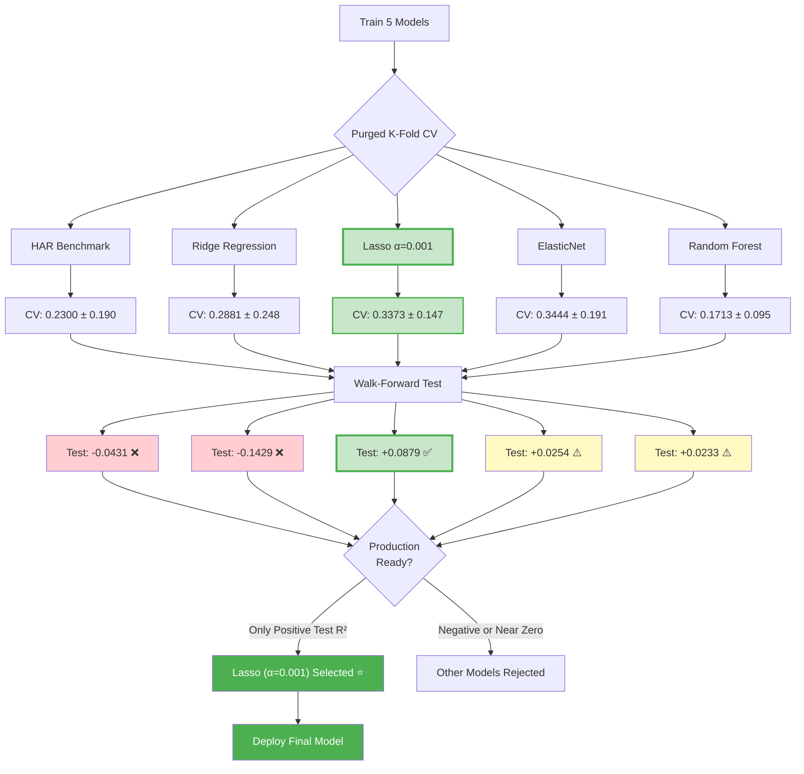
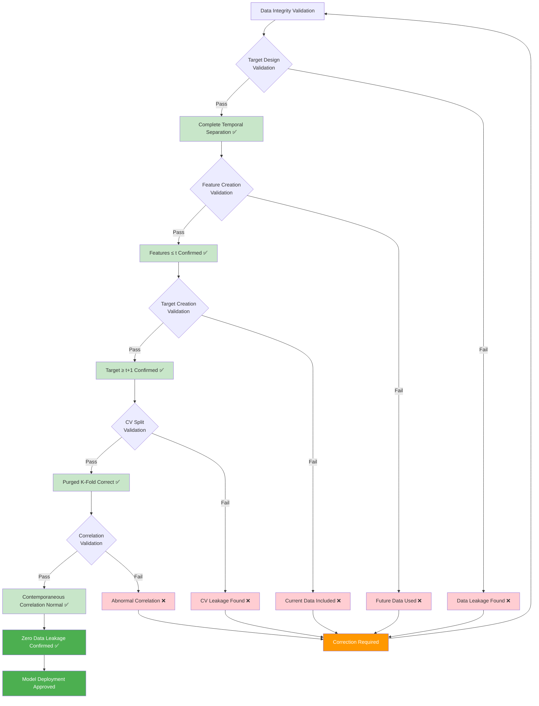

# SPY Volatility Prediction Project - Mermaid Flowchart

<!-- 한글: SPY 변동성 예측 프로젝트 프로세스 다이어그램 -->

## Complete Process Flowchart

```mermaid
flowchart TD
    Start([SPY Volatility Prediction System]) --> Step1

    Step1[1. Data Collection] --> Step1_1[yfinance SPY ETF 2015-2024]
    Step1_1 --> Step1_2[Collect OHLCV Data]
    Step1_2 --> Step1_3[Collect VIX Data]
    Step1_3 --> Step2

    Step2[2. Data Preprocessing] --> Step2_1[Handle Missing Values]
    Step2_1 --> Step2_2[Remove Outliers]
    Step2_2 --> Step2_3[Validate Data Integrity]
    Step2_3 --> Step3

    Step3[3. Feature Engineering] --> Feature_Group

    subgraph Feature_Group[31 Feature Groups]
        direction TB
        F1[VIX-based: 4]
        F2[Realized Volatility: 3]
        F3[EWMA Volatility: 3]
        F4[Intraday Volatility: 2]
        F5[Garman-Klass: 2]
        F6[Basic Volatility: 3]
        F7[Lag Features: 4]
        F8[HAR Features: 3]
        F9[Others: 7]
    end

    Feature_Group --> Step4

    Step4[4. Target Variable Creation] --> Step4_1["target_vol_5d (5-day ahead volatility)"]
    Step4_1 --> Step4_2[Complete Temporal Separation]
    Step4_2 --> Step4_3["Features: data up to t only"]
    Step4_2 --> Step4_4["Target: future data t+1 to t+5"]
    Step4_3 --> Step4_5[Zero Data Leakage Verified]
    Step4_4 --> Step4_5
    Step4_5 --> Step5

    Step5[5. Feature Selection] --> Step5_1[Correlation Analysis]
    Step5_1 --> Step5_2[Select Top 25 Features]
    Step5_2 --> Step5_3[Check Multicollinearity]
    Step5_3 --> Step6

    Step6[6. Data Split] --> Step6_1["Train set (80%, 1,990 samples)"]
    Step6 --> Step6_2["Test set (20%, 498 samples)"]
    Step6_1 --> Step7
    Step6_2 --> Step7

    Step7[7. Purged K-Fold CV] --> Step7_1[n_splits = 5]
    Step7_1 --> Step7_2["embargo = 1% (25 samples)"]
    Step7_2 --> Step7_3[Preserve Time Order]
    Step7_3 --> Step7_4[Set Train-Test Embargo]
    Step7_4 --> Step8

    Step8[8. Model Training & Validation] --> Model_Training

    subgraph Model_Training[5 Models Training]
        direction TB
        M1["8.1 HAR Benchmark<br/>CV R² = 0.2300 ± 0.190"]
        M2["8.2 Ridge Regression<br/>CV R² = 0.2881 ± 0.248"]
        M3["8.3 Lasso (α=0.001) ⭐<br/>CV R² = 0.3373 ± 0.147<br/>Most Stable"]
        M4["8.4 ElasticNet<br/>CV R² = 0.3444 ± 0.191"]
        M5["8.5 Random Forest<br/>CV R² = 0.1713 ± 0.095"]
    end

    Model_Training --> Step9

    Step9[9. Walk-Forward Test] --> Step9_1["Test on last 20% data"]
    Step9_1 --> Step9_2[Measure Test R² for Each Model]
    Step9_2 --> Test_Results

    subgraph Test_Results[Test Results]
        direction TB
        T1["Lasso: +0.0879 ✅ Only Positive"]
        T2["ElasticNet: +0.0254"]
        T3["Random Forest: +0.0233"]
        T4["HAR: -0.0431"]
        T5["Ridge: -0.1429"]
    end

    Test_Results --> Step9_3[Lasso Model Generalizes Successfully]
    Step9_3 --> Step10

    Step10[10. Economic Backtest] --> Step10_1[Volatility-Based Position Sizing]
    Step10_1 --> Step10_2["Include Transaction Costs (0.1%)"]
    Step10_2 --> Step10_3[Measure Performance Metrics]
    Step10_3 --> Backtest_Results

    subgraph Backtest_Results[Backtest Performance]
        direction TB
        B1["Annual Return: 14.10%"]
        B2["Volatility: 12.24% ✅ -0.8% Reduction"]
        B3["Sharpe Ratio: 0.989"]
        B4["Max Drawdown: -10.81%"]
    end

    Backtest_Results --> Step11

    Step11[11. Data Leakage Validation] --> Step11_1[Temporal Separation Check]
    Step11_1 --> Step11_2[Feature-Target Correlation Check]
    Step11_2 --> Step11_3[CV Split Leakage Check]
    Step11_3 --> Step11_4[Zero Data Leakage Confirmed ✅]
    Step11_4 --> Step14

    Step14[14. Final Conclusion] --> Step14_1["Lasso (α=0.001) Model Selected"]
    Step14_1 --> Step14_2["CV R² = 0.3373, Test R² = 0.0879"]
    Step14_2 --> Step14_3[Only Model Ready for Production]
    Step14_3 --> Step14_4["Volatility -0.8% Reduction Verified"]
    Step14_4 --> End([Validation Complete])

    style Step3 fill:#e1f5ff
    style Step4 fill:#e1f5ff
    style Step7 fill:#fff4e1
    style Step8 fill:#fff4e1
    style Step9 fill:#fff4e1
    style Step10 fill:#e8f5e9
    style Step11 fill:#ffe1e1
    style Step14 fill:#f3e5f5
    style M3 fill:#c8e6c9,stroke:#4caf50,stroke-width:3px
    style T1 fill:#c8e6c9,stroke:#4caf50,stroke-width:2px
    style B2 fill:#c8e6c9,stroke:#4caf50,stroke-width:2px
    style End fill:#4caf50,color:#fff
```

<!-- 전체 프로세스를 14단계로 시각화. Lasso 모델이 최종 선정되는 과정을 강조 -->

---

## Phase-Based Flowchart

```mermaid
flowchart LR
    subgraph Phase1[Phase 1: Data Preparation]
        direction LR
        P1_1[Data Collection] --> P1_2[Preprocessing]
        P1_2 --> P1_3[Generate 31 Features]
        P1_3 --> P1_4[Create Target Variable]
        P1_4 --> P1_5[Select 25 Features]
    end

    subgraph Phase2[Phase 2: Validation & Training]
        direction LR
        P2_1[Data Split] --> P2_2[Purged K-Fold CV]
        P2_2 --> P2_3[Train 5 Models]
        P2_3 --> P2_4[Walk-Forward Test]
    end

    subgraph Phase3[Phase 3: Evaluation & Analysis]
        direction LR
        P3_1[Economic Backtest] --> P3_2[Data Leakage Validation]
    end

    subgraph Phase4[Phase 4: Results & Conclusion]
        direction LR
        P4_1[Save Results] --> P4_2[Visualization & Documentation]
        P4_2 --> P4_3[Final Conclusion]
    end

    Phase1 --> Phase2
    Phase2 --> Phase3
    Phase3 --> Phase4

    style Phase1 fill:#e1f5ff
    style Phase2 fill:#fff4e1
    style Phase3 fill:#e8f5e9
    style Phase4 fill:#f3e5f5
```

<!-- 4개 Phase로 프로젝트를 단순화한 다이어그램 -->

---

## Model Comparison Flowchart

<!-- 5개 모델의 CV와 Test 성능을 비교하여 Lasso가 선정되는 과정을 시각화 -->

---

## Data Leakage Validation Flowchart

<!-- 데이터 누출을 5단계로 검증하는 프로세스. Pass/Fail 분기로 무결성 보장 -->

---

## How to Use

<!-- Mermaid 다이어그램 사용 방법 가이드 -->

You can use these Mermaid flowcharts in the following ways:

1. **Direct Insertion in GitHub README.md**
   - Copy and paste the code blocks directly into README.md
   - GitHub automatically renders Mermaid diagrams

2. **Mermaid Live Editor**
   - Real-time preview at https://mermaid.live
   - Edit code and download rendered images

3. **VS Code Extension**
   - Install "Markdown Preview Mermaid Support" extension
   - Real-time preview in markdown files

4. **Documentation Tools**
   - Supported in Notion, Confluence, GitLab, etc.
   - Specify `mermaid` as the code block language

---

**Date:** 2025-10-23
**Project:** SPY Volatility Prediction System
**Mermaid Version:** Compatible with Mermaid 9.0+
**Language:** English (with Korean comments in HTML comments)
